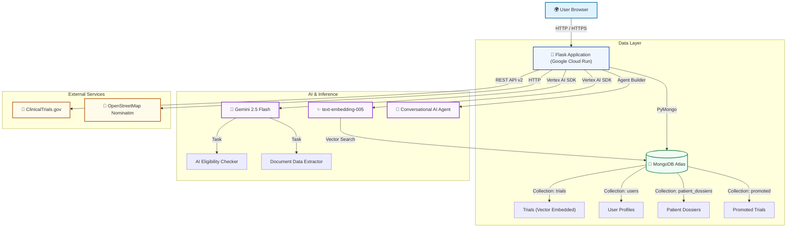

# TrialConnect 🧬

**AI-powered clinical trial matching — from symptom to study in under 60 seconds.**

[](https://trialconnect-404183020569.us-central1.run.app)
[](https://github.com/mnouira02/trialconnect)
[](https://trialconnect-404183020569.us-central1.run.app/onboarding)

> Built for the **MongoDB + Google Cloud Hackathon 2025**

---

## 🌍 The Problem

Over **80% of clinical trials fail to meet enrollment targets**, while millions of patients who qualify never find out they’re eligible. The gap between patients and trials is a *navigation problem* — not a supply problem.

Traditional search requires patients to know the right medical jargon, wade through dense eligibility criteria, and manually contact study coordinators. Most give up.

---

## 💡 The Solution

TrialConnect is a **guided AI concierge** that takes a patient from “I have lung cancer” to “Here are 12 trials you likely qualify for, ranked by distance” — in under 60 seconds.

**➡️ [Try the live demo →](https://trialconnect-404183020569.us-central1.run.app/onboarding)**

---

## ✨ Key Features

| Feature | Technology |
|---|---|
| **4-step guided onboarding wizard** | Custom wizard UI, session-backed state, auto-geocoding |
| **Semantic trial search** | MongoDB Atlas Vector Search (`text-embedding-005`, 768 dims) |
| **AI eligibility matching** | Gemini 2.5 Flash — analyses criteria vs. your profile |
| **Medical document upload** | Upload PDF/image; Gemini extracts your profile automatically |
| **Trial detail page** | Full eligibility text, location map, AI match button |
| **Proximity scoring** | Trials ranked by Haversine distance to nearest site |
| **AI agent chat** | Vertex AI Agent Builder chatbot on every results page |
| **Promoted trials** | Sponsor dashboard to boost trial visibility |
| **Live platform stats** | MongoDB aggregation pipeline — `/api/stats` |
| **Google OAuth + local auth** | Secure login with remember-me support |
| **Admin dashboard** | Full user and content management |

---

## 🔄 Guided Onboarding Flow

The signature feature: a **4-step wizard** that turns a blank search box into a personalised matching experience.

```
Step 1 ─ Choose condition     (pill picker + free text)
   ↓
Step 2 ─ Set location         (type or use GPS + radius slider)
   ↓
Step 3 ─ Build your profile   (age, sex, meds + optional doc upload → Gemini extracts it)
   ↓
Step 4 ─ Review & launch      (confirm summary, consent tick, one button)
   ↓
Results ─ Ranked trials       (vector search + geospatial + AI eligibility)
   ↓
Detail page ─ Per trial       (eligibility criteria, location map, “Check my match”)
```

---

## 🏗️ Architecture



---

## 🛠️ Tech Stack

| Layer | Technology |
|---|---|
| Frontend | HTML, Bootstrap 5, Vanilla JS, Leaflet.js |
| Backend | Python 3.11, Flask |
| Database | MongoDB Atlas (Vector Search + Geospatial + Aggregation) |
| AI / Embeddings | Google Gemini 2.5 Flash · text-embedding-005 (Vertex AI) |
| Agent | Vertex AI Agent Builder |
| Hosting | Google Cloud Run |
| Auth | Google OAuth 2.0 + Werkzeug password hashing |
| Data | ClinicalTrials.gov REST API v2 |
| Geocoding | OpenStreetMap Nominatim |
| DevOps | Docker, Cloud Build, Artifact Registry |

---

## 🧠 How AI Matching Works

1. **Onboarding** — Patient describes condition, location, age, sex, optionally uploads medical records
2. **Semantic search** — MongoDB Atlas Vector Search finds trials by meaning using `text-embedding-005`
3. **Condition boost** — Post-ranking re-scorer rewards exact condition phrase matches
4. **Proximity scoring** — Haversine distance to nearest trial site
5. **Gemini eligibility check** — Full inclusion/exclusion criteria analysed against the patient’s profile by Gemini 2.5 Flash
6. **Trial detail page** — Per-trial deep view with eligibility text, location map, and match explanation

---

## 🚀 Running Locally

### Prerequisites
- Python 3.11+
- MongoDB Atlas account
- Google Cloud project with Vertex AI enabled

### Setup

```bash
git clone https://github.com/mnouira02/trialconnect.git
cd trialconnect
python -m venv .venv
.venv\Scripts\activate   # Windows
source .venv/bin/activate  # Mac/Linux
pip install -r requirements.txt
```

### Environment Variables

Create a `.env` file from `.env.example`:

```env
FLASK_SECRET_KEY=your-secret-key
MONGODB_URI=mongodb+srv://...
GOOGLE_CLIENT_ID=your-google-oauth-client-id
GOOGLE_CLIENT_SECRET=your-google-oauth-client-secret
GOOGLE_CLOUD_PROJECT=your-gcp-project-id
VERTEX_AI_LOCATION=us-central1
GOOGLE_MAPS_API_KEY=your-maps-api-key
ADMIN_EMAIL=your-admin-email
```

### Seed the database

```bash
python seed_mongodb.py
# Force re-embed (if switching embedding model):
$env:FORCE_REEMBED="1"; python seed_mongodb.py   # PowerShell
FORCE_REEMBED=1 python seed_mongodb.py            # bash/zsh
```

### Run

```bash
python run.py
```

App at `http://localhost:5000` — start at `/onboarding` for the full guided experience.

---

## ☁️ Deploy to Cloud Run

```bash
gcloud run deploy trialconnect \
  --source . \
  --region us-central1 \
  --project YOUR_PROJECT_ID
```

---

## 📊 Live Stats

Real-time platform metrics via MongoDB aggregation:

```
GET /api/stats
```

```json
{
  "total_trials": 4468,
  "recruiting": 2341,
  "conditions_covered": 26,
  "top_conditions": [
    {"condition": "Breast Cancer", "count": 200},
    ...
  ]
}
```

---

## 📁 Project Structure

```
trialconnect/
├── trialconnect/
│   ├── __init__.py          # App factory
│   ├── routes.py            # All Flask routes
│   ├── oauth_setup.py       # Google OAuth
│   ├── static/              # CSS, JS, images
│   └── templates/
│       ├── onboarding.html    # ⭐ Guided wizard (NEW)
│       ├── trial_detail.html  # ⭐ Trial detail page (NEW)
│       ├── index.html         # Search + results
│       └── …
├── helpers.py               # MongoDB, Gemini, search logic
├── seed_mongodb.py          # 4 468-trial seeder
├── agent.py                 # Vertex AI agent definition
├── Dockerfile
├── requirements.txt
└── run.py
```

---

## 🔗 API Endpoints

| Endpoint | Method | Description |
|---|---|---|
| `/onboarding` | GET | **Guided 4-step wizard** (start here) |
| `/trial/<nct_id>` | GET | Full trial detail + AI eligibility |
| `/api/search` | GET | Vector search by condition + location |
| `/api/stats` | GET | Live platform stats (MongoDB aggregation) |
| `/api/check_match/<nct_id>` | GET/POST | AI eligibility check |
| `/api/upload_profile` | POST | Gemini doc extraction |
| `/api/openapi.json` | GET | OpenAPI 3.0 spec |

---

## 👥 Team

Built with ❤️ for patients navigating the clinical trial landscape.

---

## 📄 License

MIT License
